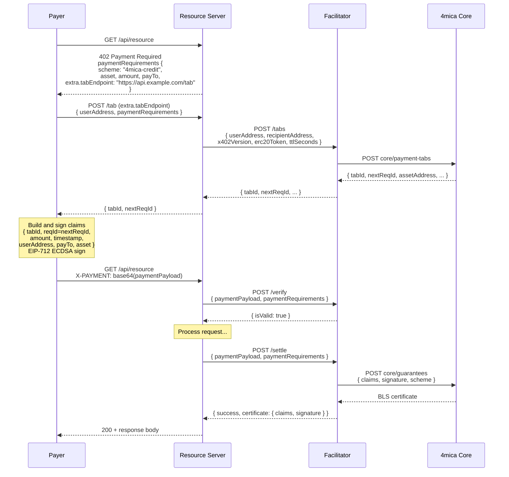
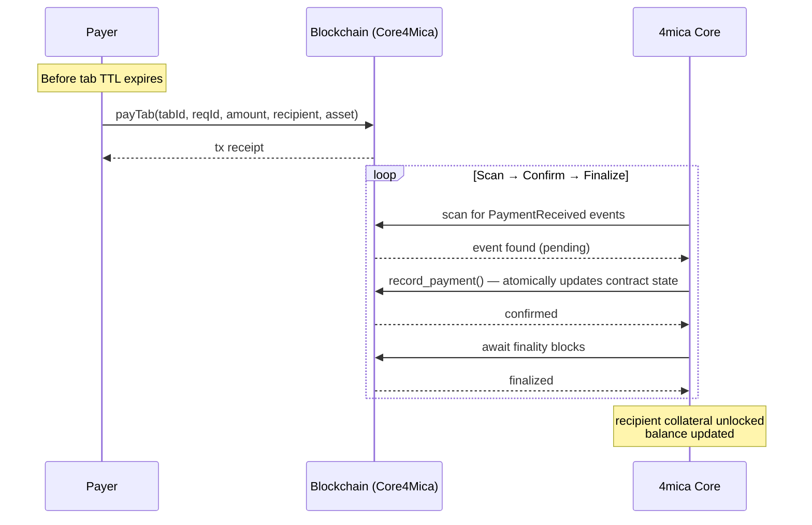
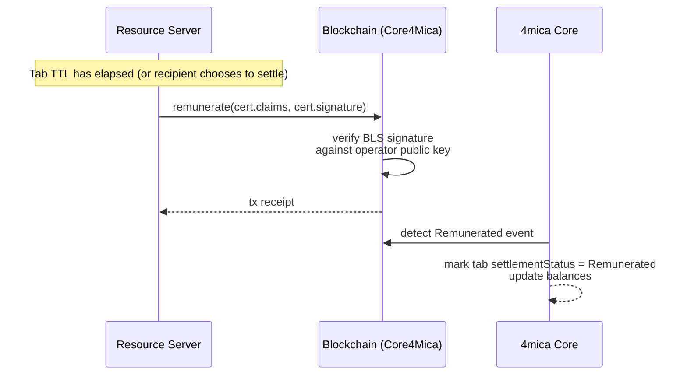

# x402-4mica Facilitator

<p align="center">
  <a href="https://github.com/4mica-network/x402-4mica/actions/workflows/ci.yml">
    
  </a>
  <a href="LICENSE">
    
  </a>
</p>

A facilitator for the x402 protocol that runs the 4mica credit flow. Resource servers call it to
open tabs, validate payment payloads against their `paymentRequirements`, and settle by returning
the BLS certificate to the recipient.


**Contents**
- [How to use the system](#how-to-use-the-system)
- [Integrate from x402](#integrate-from-x402)
- [Run your own facilitator](#run-your-own-facilitator)

## How to use the system

### Quick integration (resource servers)

- Configure the 4mica facilitator (for example `https://x402.4mica.xyz/`) and choose a POST tab endpoint on your API (e.g. `POST https://api.example.com/x402/tab`). Your `402 Payment Required` responses should advertise `scheme = "4mica-credit"`, a supported `network`, and set `payTo` / `asset` / `maxAmountRequired`, embedding your tab endpoint in `paymentRequirements.extra.tabEndpoint`.
- Implement the tab endpoint to accept `{ userAddress, paymentRequirements }`. For each call, open or reuse a tab by calling the facilitator's standard `POST /tabs` with `{ userAddress, recipientAddress = payTo, x402Version, erc20Token = asset, ttlSeconds?, network? }`, then return the tab response (at least `tabId` and `userAddress`) to the client. The facilitator derives the core `guaranteeVersion` from `x402Version` automatically. If you configure multiple networks, pass `network` to target the correct core API URL. Cache tabs per `(user, recipient, asset, guaranteeVersion)` if you want to avoid unnecessary `/tabs` calls; the facilitator will return the existing tab for that exact active identity either way.
- Clients combine this tab with your original `paymentRequirements` to build and sign a guarantee, producing the x402 `paymentPayload` that they send on the retried request for the protected resource. You never construct this payload yourself; you only need to validate and consume it.
- When a request arrives with a payment payload, send it together with the original `paymentRequirements` to the facilitator's `/verify` and `/settle` endpoints. Use `/verify` as an optional preflight check before doing work, and `/settle` once you are ready to accept credit and obtain the BLS certificate for downstream remuneration.

### Quick integration (clients)

- Python SDK:

  ```bash
  pip install sdk-4mica
  ```

  ```python
  import asyncio
  from fourmica_sdk import Client, ConfigBuilder, PaymentRequirements, X402Flow

  payer_key = "0x..."    # wallet private key
  user_address = "0x..." # address to embed in the claims

  async def main():
      cfg = ConfigBuilder().wallet_private_key(payer_key).rpc_url("https://api.4mica.xyz/").build()
      client = await Client.new(cfg)
      flow = X402Flow.from_client(client)

      # Fetch the recipient's paymentRequirements (must include extra.tabEndpoint)
      req_raw = fetch_requirements_somehow()[0]
      requirements = PaymentRequirements.from_raw(req_raw)

      payment = await flow.sign_payment(requirements, user_address)
      headers = {"X-PAYMENT": payment.header}  # client retry header (decode to paymentPayload for /verify)
      await client.aclose()

  asyncio.run(main())
  ```

- TypeScript SDK:

  ```bash
  npm install sdk-4mica
  ```

  ```ts
  import { Client, ConfigBuilder, PaymentRequirements, X402Flow } from "sdk-4mica";

  async function run() {
    const cfg = new ConfigBuilder().walletPrivateKey("0x...").build();
    const client = await Client.new(cfg);
    const flow = X402Flow.fromClient(client);

    const reqRaw = fetchRequirementsSomehow()[0]; // includes extra.tabEndpoint
    const requirements = PaymentRequirements.fromRaw(reqRaw);

    const payment = await flow.signPayment(requirements, "0xUser");
    const headers = { "X-PAYMENT": payment.header }; // decode to paymentPayload for /verify
    await client.aclose();
  }

  run();
  ```

- Rust SDK: `cargo add sdk-4mica` and call
  `X402Flow::sign_payment(requirements, user_address)` to obtain the same `payment.header` for the
  retry request.

### Demo example

You can pair the client with `examples/server/mock_paid_api.py`, a FastAPI server that simulates a
paywalled endpoint. Start it with `python examples/server/mock_paid_api.py` (set `PORT` to override
the default `9000`). The mock resource will call the facilitator's `/verify` endpoint (defaulting to
`https://x402.4mica.xyz/`; override with `FACILITATOR_URL`) whenever it receives a payment payload
(for example decoded from an `X-PAYMENT` header).

The bundled Rust example shows how to sign a payment
header with `sdk-4mica`:

```bash
# requires PAYER_KEY, USER_ADDRESS, RESOURCE_URL and ASSET_ADDRESS
cargo run --example rust_client
```

The example will read environment variables from `examples/.env` (or a root `.env`) if present. A
Python counterpart lives in `examples/python_client/client.py` (install deps with `pip install -r
examples/python_client/requirements.txt`). A TypeScript version lives in `examples/ts_client`
(`npm install && npm start`).

### Payment payload schema (v1)

`paymentPayload` is a JSON envelope:

```json
{
  "x402Version": 1,
  "scheme": "4mica-credit",
  "network": "eip155:80002",
  "payload": {
    "claims": {
      "user_address": "<0x-prefixed checksum string>",
      "recipient_address": "<0x-prefixed checksum string>",
      "tab_id": "<decimal or 0x value>",
      "amount": "<decimal or 0x value>",
      "asset_address": "<0x-prefixed checksum string>",
      "timestamp": 1716500000,
      "version": 1
    },
    "signature": "<0x-prefixed wallet signature>",
    "scheme": "eip712"
  }
}
```

### Payment payload schema (v2)

This repository follows the V2 schema implemented in the checked-out upstream codebases
(`4mica-core`, `sdk-4mica`, `ts-sdk-4mica`, `py-sdk-4mica`), and the facilitator does not require
`validationChainId` inside `paymentRequirements.extra`. The signed claim still carries
`validation_chain_id`, and the facilitator derives the expected chain id from the CAIP-2 payment
network during V2 validation.

`paymentPayload` for x402 V2 uses the `accepted` envelope shape:

```json
{
  "x402Version": 2,
  "accepted": {
    "scheme": "4mica-credit",
    "network": "eip155:80002",
    "amount": "<decimal or 0x value>",
    "payTo": "<0x-prefixed checksum string>",
    "asset": "<0x-prefixed checksum string>"
  },
  "payload": {
    "claims": {
      "version": "v2",
      "user_address": "<0x-prefixed checksum string>",
      "recipient_address": "<0x-prefixed checksum string>",
      "tab_id": "<decimal or 0x value>",
      "req_id": "<decimal or 0x value>",
      "amount": "<decimal or 0x value>",
      "asset_address": "<0x-prefixed checksum string>",
      "timestamp": 1716500000,
      "validation_registry_address": "<0x-prefixed checksum string>",
      "validation_request_hash": "<0x-prefixed 32-byte hex string>",
      "validation_chain_id": 80002,
      "validator_address": "<0x-prefixed checksum string>",
      "validator_agent_id": "<decimal or 0x value>",
      "min_validation_score": 80,
      "validation_subject_hash": "<0x-prefixed 32-byte hex string>",
      "required_validation_tag": "hard-finality"
    },
    "signature": "<0x-prefixed wallet signature>",
    "scheme": "eip712"
  }
}
```

The facilitator enforces that:

- `scheme` / `network` match both `/supported` and the resource server's requirements.
- `payTo` equals the `recipient_address` present inside the claim.
- `asset` must match the signed `amount` claim's asset exactly.
- For V1, `maxAmountRequired` must match the signed `amount` exactly.
- For V2, `amount` must match the signed `amount` exactly.
- For V2, `paymentRequirements.extra` must include the validation policy fields expected by the
  SDKs and facilitator: `validationRegistryAddress`, `validatorAddress`, `validatorAgentId`,
  `minValidationScore`, `jobHash`, and optional `requiredValidationTag`.
- For V2, the signed `validation_chain_id` must match the CAIP-2 payment network, and the signed
  validation registry must be present in core's `trusted_validation_registries`.
- By default, the facilitator verifies certificates against the active guarantee domain advertised
  by core. If `X402_GUARANTEE_DOMAIN` is set (legacy `FOUR_MICA_GUARANTEE_DOMAIN` /
  `4MICA_GUARANTEE_DOMAIN` are also honored), that value overrides the core-provided domain.

### HTTP API

- `GET /supported` – returns all `(scheme, network)` tuples the facilitator can service (4mica and,
  if configured, any additional `exact` flows).
- `GET /health` – liveness probe that returns `{ "status": "ok" }`.
- `POST /tabs`
  - Request: `{ "userAddress", "recipientAddress", "x402Version"?, "guaranteeVersion"?, "network"?, "erc20Token"?, "ttlSeconds"? }`.
    If `network` is omitted the facilitator uses its default network (the first entry in
    `X402_NETWORKS`).
    Networks use CAIP-2 identifiers (e.g., `eip155:80002`).
    Use `erc20Token = null` (or omit it) for ETH tabs; otherwise pass the token contract address.
    `x402Version` is the preferred field; the facilitator maps it to the core `guaranteeVersion`.
    `guaranteeVersion` remains available for compatibility. If both are supplied they must match.
    If neither is supplied, the facilitator defaults to version `1`.
  - Response: `{ "tabId", "userAddress", "recipientAddress", "assetAddress", "startTimestamp", "ttlSeconds", "nextReqId" }`.
    `tabId` is always emitted as a canonical hex string. Recipients call this after a user shares
    their wallet; the facilitator reuses the existing tab for that exact version-scoped identity whenever possible.
    `nextReqId` is the next sequential request id to include when signing a guarantee.
- `POST /verify`
  - Request: `{ "x402Version": 1|2, "paymentPayload": { ... }, "paymentRequirements": { ... } }`.
  - Response: `{ "isValid": true|false, "invalidReason"?, "certificate": null }`.
- `POST /settle`
  - Request: same shape as `/verify`.
  - Response: for 4mica, `{ "success": true, "networkId": "<network>", "certificate": { "claims", "signature" } }`.
    When delegating to the `exact` facilitator the structure mirrors upstream x402 responses and may
    include `txHash`.
    If `X402_DEBIT_URL` is set, debit requests are proxied to the configured x402-rs
    facilitator, allowing clients to follow the x402 debit flow unchanged.

### End-to-end credit flow

The sequence below covers the full lifecycle: tab discovery, guarantee issuance, and how the tab is
ultimately paid on-chain.

#### 1. Tab discovery and guarantee issuance

The `402 Payment Required` response carries a `tabEndpoint` URL (inside
`paymentRequirements.extra.tabEndpoint`) that points to an endpoint **on the resource server
itself**. The payer calls that endpoint—not the facilitator directly—to obtain a tab. The resource
server then proxies the call to the facilitator, which in turn contacts 4mica core.



Multiple requests reuse the same tab by incrementing `reqId` on each call (`reqId=0`, `1`, `2`, …).
The facilitator rejects duplicate `reqId`s, preventing replay attacks.

#### 2. On-chain tab payment

Once the resource server holds a BLS certificate it has two ways to collect the underlying
collateral on-chain. Both paths interact with the Core4Mica smart contract.

**Path A – Payer pays the tab (`payTab`)**

The payer proactively repays the amount they guaranteed before the tab TTL expires. 4mica core
scans the blockchain for the resulting `PaymentReceived` event and, once the transaction reaches
finality, unlocks the collateral and credits the recipient.



**Path B – Resource server remunerates (`remunerate`)**

If the payer does not pay before the tab TTL lapses, the resource server submits the BLS
certificate directly to the contract. The contract verifies the BLS signature and slashes the
payer's posted collateral, transferring it to the recipient.



The SDK helpers for both paths:

```ts
// Path A — payer repays
await client.user.payTab(tabId, reqId, amount, recipientAddress, erc20Token);

// Path B — resource server remunerates using the BLS cert from /settle
await client.recipient.remunerate(cert);
```

After Path A, poll `client.user.getTabPaymentStatus(tabId)` to confirm `paid` equals the
guaranteed amount. After Path B, the recipient's balance is updated once the transaction finalizes.

## Integrate from x402

The facilitator can transparently replace the EIP-3009/x402 debit flow. The key is to swap the old
`exact` scheme for the 4mica credit primitives described below.

### Changes resource servers must make

1. **Point at the credit facilitator** – set `X402_FACILITATOR_URL=https://x402.4mica.xyz`
   (or the TypeScript `CC_FACILITATOR_URL`). This host validates guarantee envelopes and returns BLS
   certificates instead of ERC-3009 receipts.
2. **Expose a tab endpoint on your server** – whenever a user shares their wallet, the client will
   `POST` to the URL advertised in `paymentRequirements.extra.tabEndpoint`. That endpoint should call
   `POST https://x402.4mica.xyz/tabs` with
   `{ userAddress, recipientAddress, x402Version, network?, erc20Token?, ttlSeconds? }`, then relay
   the facilitator response back to the client.
   Cache `{ tabId, assetAddress, startTimestamp, ttlSeconds }` and reuse that tab per
   `(user, recipient, asset, guaranteeVersion)` combination.
3. **Emit credit-flavoured `paymentRequirements`** – embed the latest tab metadata and switch the
   identifying strings:

   ```jsonc
   {
     "scheme": "4mica-credit",
     "network": "eip155:80002",
     "maxAmountRequired": "<decimal or 0x amount>",
     "resource": "/your/resource",
     "description": "Describe the protected work",
     "mimeType": "application/json",
     "payTo": "<recipientAddress>",
     "maxTimeoutSeconds": 300,
     "asset": "<assetAddress>",
     "extra": {
       "tabEndpoint": "https://api.example.com/tab",
       "...other metadata you already add..."
     }
   }
   ```

   The facilitator enforces that `scheme`, `network`, `payTo` and `asset`
   match the tab exactly, so keep them synchronized.

4. **Expect credit certificates during settlement** – `/verify` still performs structural checks and
   `/settle` now returns `{ success, networkId: "eip155:80002", certificate: { claims, signature } }`.
   Persist the certificate if you need to downstream claim remuneration via 4mica core.

### Changes clients (payers) must make

Payers sign guarantees instead of EIP-3009 transfers. Use the official SDK `sdk-4mica` to manage collateral and produce signatures.

1. **Install the SDK** – inside your agent crate run

   ```bash
   cargo add sdk-4mica
   ```

   or add the same entry manually to `Cargo.toml`.

2. **Configure the client** – create a `Client` with the payer's signing key. The SDK pulls the
   remaining parameters (domain separator, operator key, etc.) from the configured core RPC URL.

   ```rust
   use alloy::signers::local::PrivateKeySigner;
   use sdk_4mica::{Client, ConfigBuilder};

   let signer: PrivateKeySigner = std::env::var("PAYER_KEY")?.parse()?;
   let config = ConfigBuilder::default().signer(signer).build()?;
   let client = Client::new(config).await?;
   ```

3. **Fund the tab** – before requesting credit, ensure the payer has collateral using
   `client.user.deposit(...)` (or `approve_erc20` + `deposit` for tokens). Refer to the SDK README
   for concrete examples.
4. **Sign guarantee claims** – derive `PaymentGuaranteeRequestClaims` from the recipient's
   `paymentRequirements` (copy `tabId`, `userAddress`, `payTo`, `asset`, the desired `amount`, and
   the most recent `nextReqId`),
   choose a signing scheme (usually `SigningScheme::Eip712`), and call `client.user.sign_payment`.

   ```rust
   use sdk_4mica::{PaymentGuaranteeRequestClaims, SigningScheme, U256};

   let claims = PaymentGuaranteeRequestClaims::new(
       payer_wallet.clone(),
       pay_to.clone(),
       tab_id_u256,
       // next_req_id should come from the /tabs response (nextReqId), parsed to U256.
       next_req_id,
       U256::from(amount_wei),
       chrono::Utc::now().timestamp() as u64,
       Some(asset.clone()),
   );
   let signature = client
       .user
       .sign_payment(claims.clone(), SigningScheme::Eip712)
       .await?;
   ```

5. **Build the payment payload** – construct `{ x402Version: 1, scheme: "4mica-credit", network:
"eip155:80002", payload: { claims, signature, scheme: "eip712" } }` (see
`examples/rust_client/main.rs` or `examples/python_client/client.py`) and send it alongside the retrying
   HTTP request.
6. **Settle your tabs** – every tab response includes `ttlSeconds`, which is the settlement window in
   seconds from `startTimestamp`. Recipients should call `/settle` (and issue the guarantee) before
   that TTL lapses; once a certificate comes back they must relay the `tabId`, `reqId`, `amount`, and
   `asset` to the payer. Payers are expected to clear the balance within the same TTL window to avoid
   the recipient redeeming their collateral. Use the SDK's `UserClient::pay_tab` helper to repay the
   outstanding credit with the exact asset used when the tab was opened:

   ```rust
   use sdk_4mica::U256;

   let receipt = client
       .user
       .pay_tab(tab_id, req_id, U256::from(amount_wei), recipient_address.clone(), erc20_token)
       .await?;
   ```

   After broadcasting the repayment transaction, poll `client.user.get_tab_payment_status(tab_id)`
   (or `client.user.get_user()`) to verify that `paid` equals the guaranteed amount. If the TTL
   expires without repayment the recipient is free to run `recipient.remunerate(cert)` from the SDK,
   which slashes your posted collateral on-chain.

## Run your own facilitator

### Configuration

Environment variables (defaults shown):

```bash
export HOST=0.0.0.0
export PORT=8080
export X402_SCHEME=4mica-credit
# List of supported networks (JSON). Each entry must include `{ "network", "coreApiUrl" }`
# where `network` is a CAIP-2 identifier (e.g., `eip155:80002`).
export X402_NETWORKS='[{"network":"eip155:80002","coreApiUrl":"https://api.4mica.xyz/"}]'
# Legacy single-network fallback if X402_NETWORKS is unset
export X402_NETWORK=eip155:80002

# 4mica public API – used to fetch operator parameters
export X402_CORE_API_URL=https://api.4mica.xyz/
# Default asset address to apply when callers omit assetAddress in /tabs requests
export ASSET_ADDRESS=0x...

# Optional: pin the expected domain separator (32-byte hex, 0x-prefixed)
export X402_GUARANTEE_DOMAIN=0x...
# legacy: FOUR_MICA_GUARANTEE_DOMAIN / 4MICA_GUARANTEE_DOMAIN

# Optional: proxy x402 debit flows to an existing x402-rs facilitator
export X402_DEBIT_URL=https://x402.example.com/

# Optional: enable standard x402 settlement for EVM networks
export SIGNER_TYPE=private-key
export EVM_PRIVATE_KEY=0x...
export RPC_URL_BASE=https://mainnet.base.org
export RPC_URL_BASE_SEPOLIA=https://sepolia.base.org
```

When `X402_NETWORKS` is present it overrides the legacy `X402_NETWORK` / `X402_CORE_API_URL`
environment variables and enables multi-network support. Each configured network gets its own 4mica
Core API base URL so the facilitator can fetch operator parameters and issue guarantees for that
network independently.

On startup the facilitator loads the public parameters described above and, if the optional x402
variables are present, initialises the upstream `exact` ERC-3009 facilitator as well. Any schemes
that fail to initialise are omitted from `/supported`.
When `X402_DEBIT_URL` is provided, `/supported` also includes the debit schemes advertised by
the referenced x402-rs facilitator, and `/verify` / `/settle` proxy those requests to it.

### Running

```bash
cargo run
```

The bound address is logged on start-up. Use `GET /supported` to read the `(scheme, network)` pair
that resource servers should use inside their `402 Payment Required` responses.

### Testing

```bash
cargo test
```

Integration-style tests use a mock verifier to exercise `/verify`, `/settle`, `/tabs`, and the
discovery endpoints without contacting 4mica.

Point your x402 resource server at this facilitator to outsource 4mica guarantee verification while
keeping custody, settlement, and tab management under your own infrastructure.

### How the facilitator moves data

- **Startup** – the process loads configuration from the environment, then calls
  `X402_CORE_API_URL/core/public-params` (or the first `coreApiUrl` listed inside `X402_NETWORKS`) to
  fetch the operator's BLS public key, active guarantee domain, accepted guarantee versions, and
  related metadata. Those values are kept in memory and reused for later requests.
- **Tab provisioning (`POST /tabs`)** – recipients can ask the facilitator to open a payment tab on
  their behalf. The facilitator relays the request to `core/payment-tabs`, converts the 4mica
  response into a plain JSON payload, and hands the tab metadata back to the resource server.
- **Verification (`POST /verify`)** – recipients send the `paymentPayload` plus the
  `paymentRequirements` they issued to the client. The facilitator validates the claims against the
  requirements and mirrors the upstream x402 error semantics. No 4mica network call is made in this
  path.
- **Settlement (`POST /settle`)** – recipients replay the same payload once they are ready to accept
  credit. The facilitator re-runs validation, submits the signed guarantee to
  `core/guarantees`, receives the BLS certificate, verifies it against the cached operator public
  key (and optional domain), and returns the certificate to the caller.

If EVM settlement variables are present the facilitator also instantiates the upstream `exact`
facilitator from `x402-rs`, exposing those `(scheme, network)` pairs on `/supported`.
